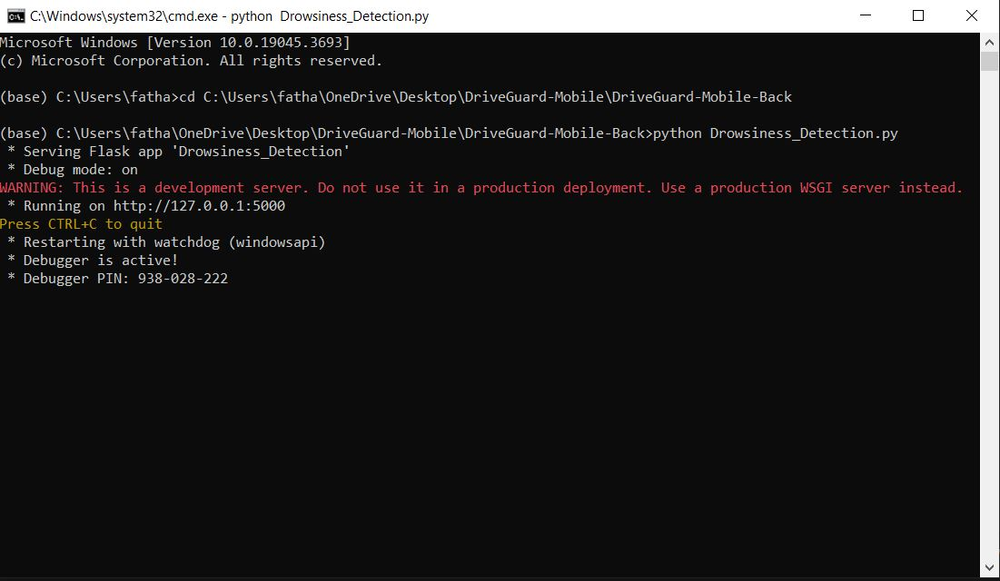
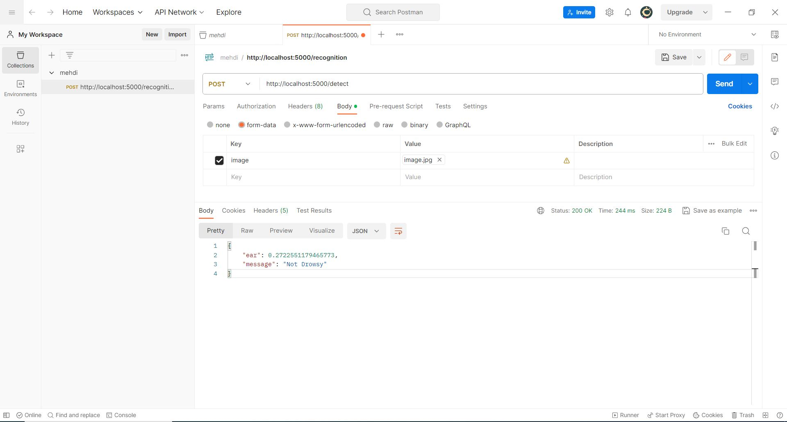
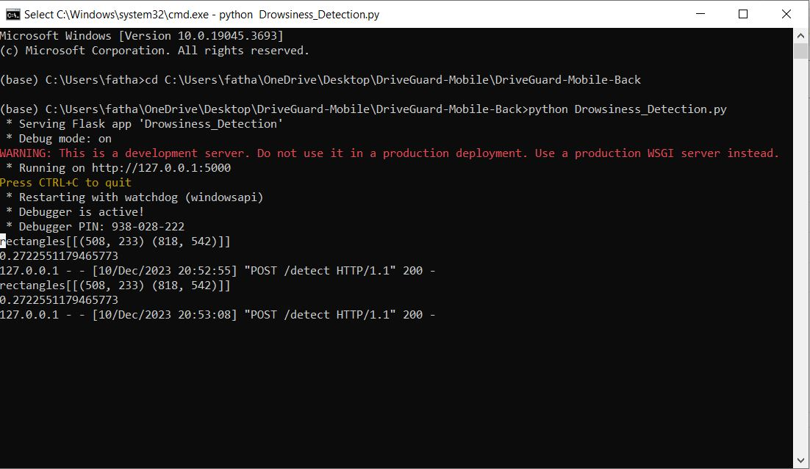

# Drowsiness Detection using Eye Aspect Ratio

## Technologies Used

- **Flask**: Python web framework used to build RESTful APIs for image processing.
- **Dlib**: Toolkit used for machine learning and object detection, employed here for face and landmark detection.
- **OpenCV (cv2)**: Library for computer vision and image processing used for decoding and manipulating images.
- **imutils**: Utilities for image processing used to handle basic image processing tasks efficiently.

## Overview

This project utilizes Flask, Dlib, OpenCV, and imutils libraries to detect drowsiness in individuals by analyzing eye aspect ratios from facial landmarks in images.

## Functionality

The main functionality revolves around the `/detect` endpoint, which receives an image file and processes it to determine drowsiness based on the calculated eye aspect ratio.

### How to Use

1. **Setup and Dependencies**:
   - Ensure you have Python installed.
   - Install the necessary libraries using pip:
     ```
     pip install flask scipy dlib opencv-python imutils
     ```

2. **Run the Application**:
   - Execute the Python script (`Drowsiness_Detection.py`) to start the Flask server.
   - The server will start locally and listen for requests, specifically targeting the `/detect` endpoint for drowsiness detection.

3. **Testing with Postman**:
   - Utilize Postman for testing requests to the `/detect` endpoint.
   - Send a POST request to `/detect` with an attached image file.
   - Receive a JSON response indicating whether the person in the image is drowsy or not, along with the calculated eye aspect ratio.

## Steps Taken

1. **Flask Server Initialization**:
   - Set up the Flask application and started the server to listen for incoming requests.
   

2. **Image Upload and JSON Response via Postman**:
   - Utilized Postman to send an image file to the `/detect` endpoint and received a JSON response indicating drowsiness status.
   

3. **CMD Server Request Details**:
   - Viewed and analyzed the request details in the command-line server upon receiving the request sent from Postman.
   

## Results and Conclusion

This implementation analyzes uploaded images for drowsiness by examining the eye aspect ratio of detected faces. The accuracy of drowsiness detection may vary based on the input image quality, the threshold (`thresh`), and the individual's eye characteristics.
